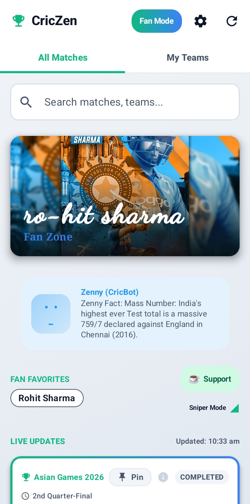
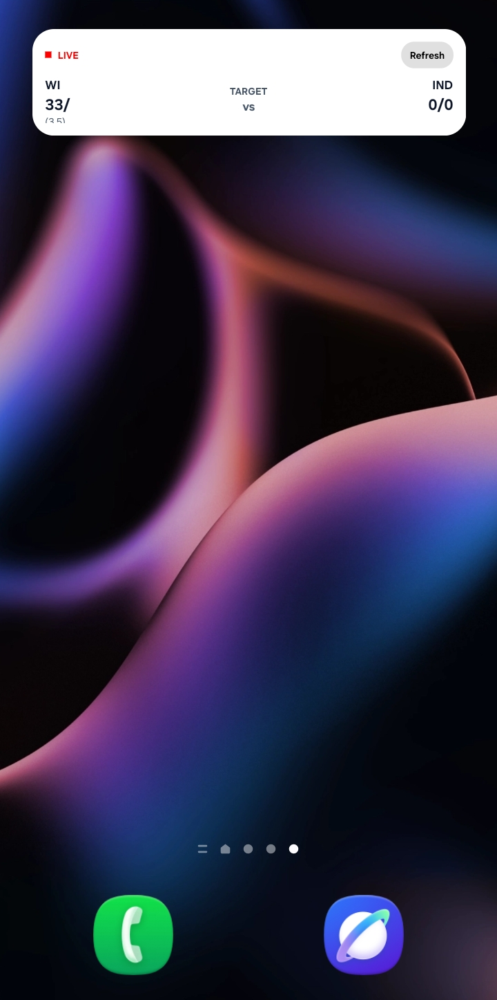
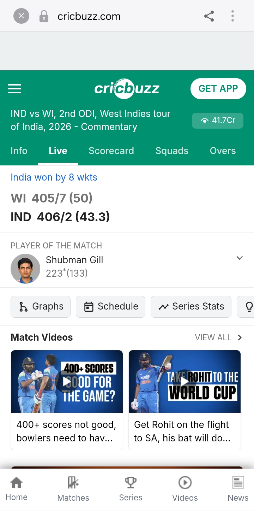
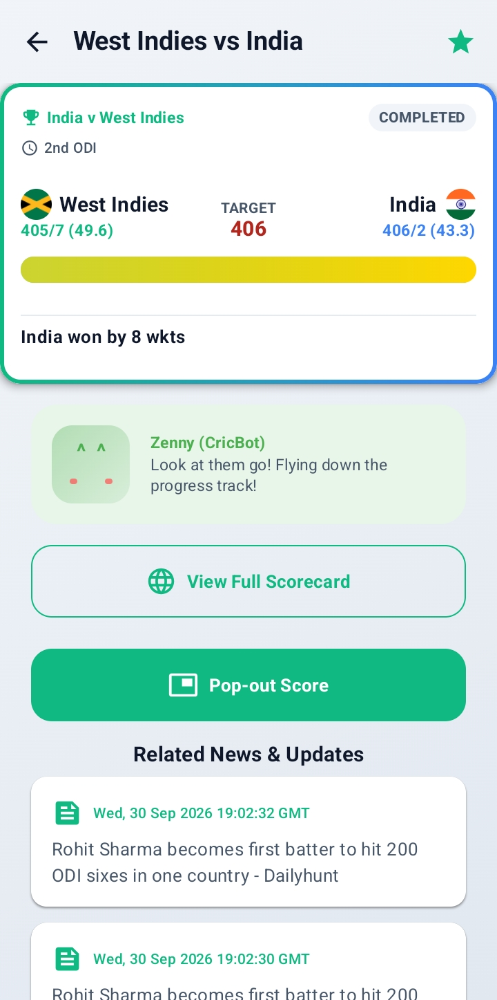

# CricZen 🏏
> Find your focus. Follow your game.

CricZen is an open-source, ad-free cricket companion for Android — live scores, personalized news, smart notifications, and a Fan Mode built around your favourite player. No clutter, no betting ads, and gentle on battery and data.

## Screenshots 📸

| Fan Mode | Match Detail & News | Home Widget |
|:---:|:---:|:---:|
|  |  |  |
| Idol wallpaper, Zenny (CricBot) facts, Fan Favorites | Full scorecard, pop-out score, related news | Live scores on your home screen |

### 🖥️ Full scorecard, without leaving the app

| | |
|:---:|:---:|
|  |  |
| Tap "View Full Scorecard" — Cricbuzz opens right inside CricZen | The record chase, tracked live: WI 405/7, IND 406/2 |

## Features

### 📊 Live scores dashboard
- Live scores with auto-refresh, pull-to-refresh, and offline caching for poor networks
- Pin matches, set target predictions, and follow run chases on a live progress bar
- Search across matches and teams; **My Teams** tab with preferred-match sorting

### 📰 News that finds you
- **Top Stories** rail on the dashboard, personalized to your teams, players, and idol
- News cards woven into the match feed, plus related news on every match page

### 🔔 Notifications that understand cricket
- Wicket, milestone, and match-event alerts for the teams you follow
- League picks expand to franchises — follow "IPL" and actually get MI / CSK / RCB alerts

### ⭐ Fan Mode
- Set your idol's wallpaper as the app header
- On match days the header comes alive: pulsing border, live score chip, and your idol's live highlight line
- Fan Favorites, plus **Zenny (CricBot)** — an offline cricket historian serving facts and trivia during breaks and rain delays

### 📱 Everyday extras
- Home-screen widget with live scores at a glance
- Picture-in-Picture pop-out score that floats while you chat or browse
- Dark mode and Data Saver (Sniper) mode for low-data days
- In-app updates delivered straight from GitHub Releases

## Built with
Jetpack Compose (Material 3) · MVVM + Clean Architecture · Room + DataStore · Retrofit/OkHttp · Glance widgets · WorkManager

## Build it yourself
1. Clone: `git clone https://github.com/karanraj-ux/CricZen.git`
2. Open in Android Studio, sync Gradle, hit Run.

Release APKs are built and signed automatically by CI on every `v*` tag.

## License 📜
MIT — see the [LICENSE](LICENSE) file for details.
